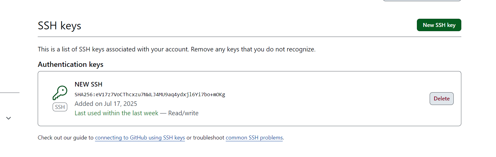
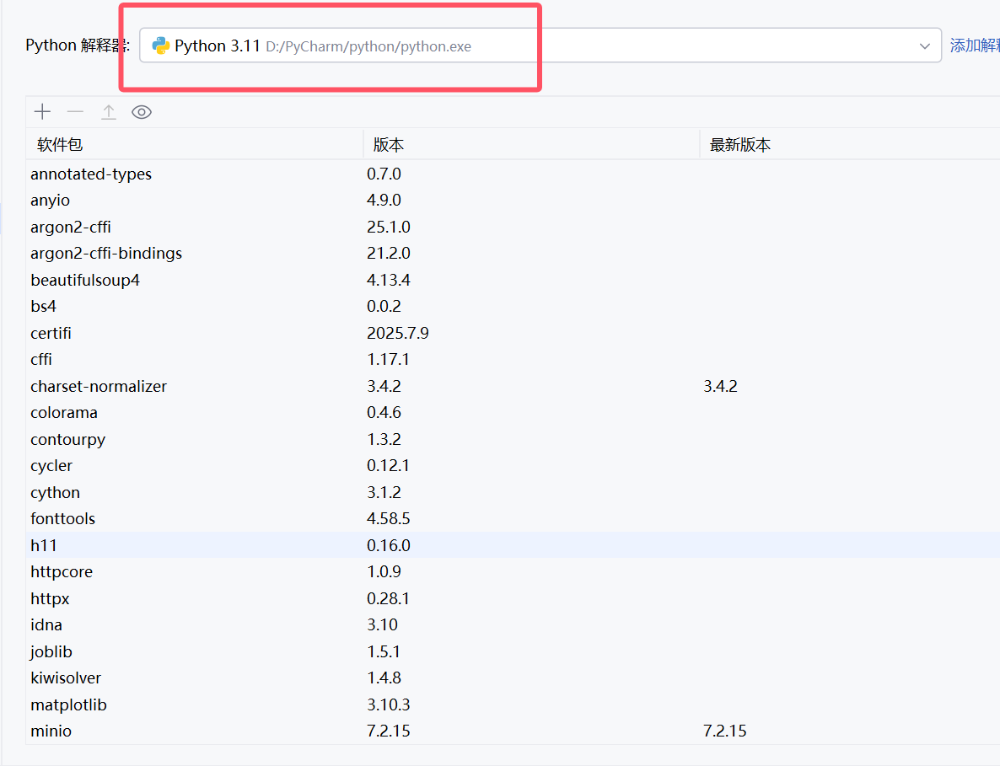
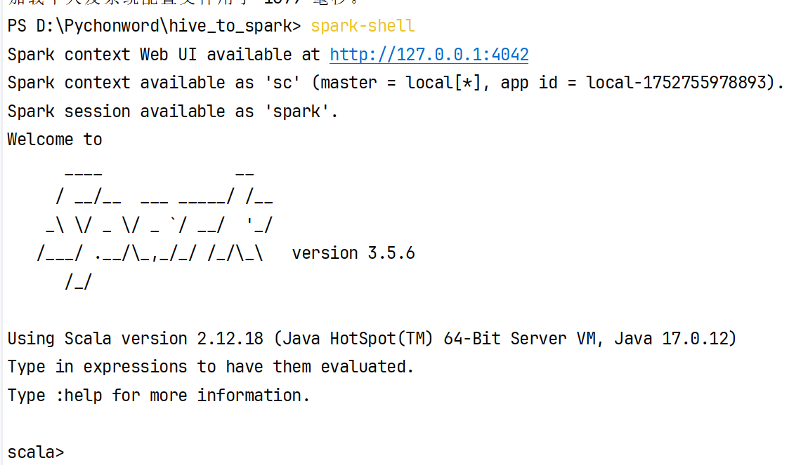
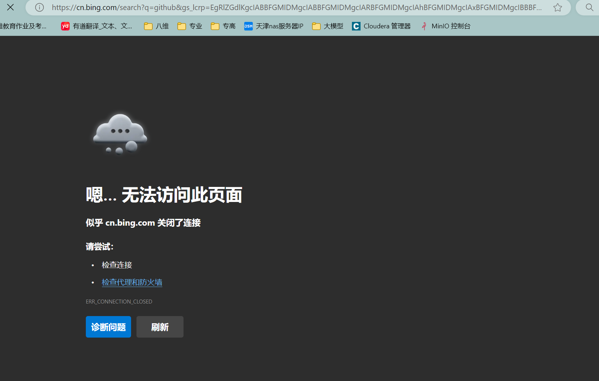

###20250717 工作日报
> 1.通过影刀入门来了解并简单使用影刀
>
> 并且能够成功运行并展示出来

> 2.运行影刀的时候出现了弹窗的问题，通过等待可以使弹窗自动消失
> 或者说在豆包搜索怎么禁用窗口来使弹窗消失

> 3.在搞github的时候出现了克隆失败的问题，通过搜索豆包以及实践下，重新配置了一个ssh秘钥
> 这样就可以把github上面的东西克隆到idea上面
> 4.在搞pyspark的时候发现了报错的现象，python的版本过高或者spark的版本过高都会导致报错的
> 现象，所以需要降版本，最终把python的解释器的版本给降到了python11，spark的版本降到了3.5.6
> 同时也发现了一个现象，并不是所有的新版的东西都能够适配的，有的东西可能更兼容版本低的东西
> 
> 
> 在搞spark的时候一直产生报错，最后发现自己的Scala也是坏的，所以先搞了Scala才搞得spark
> 现在spark和pyspark都能够正常使用，但是前提是得兼容，否则还会报错

> 5.在搞github的时候，一开始不启动小云朵的时候是好的，能够正常打开github但是启动小云朵以后
> 不能正常打开了 可能是因为网络的问题，换个地址就能够正常使用了