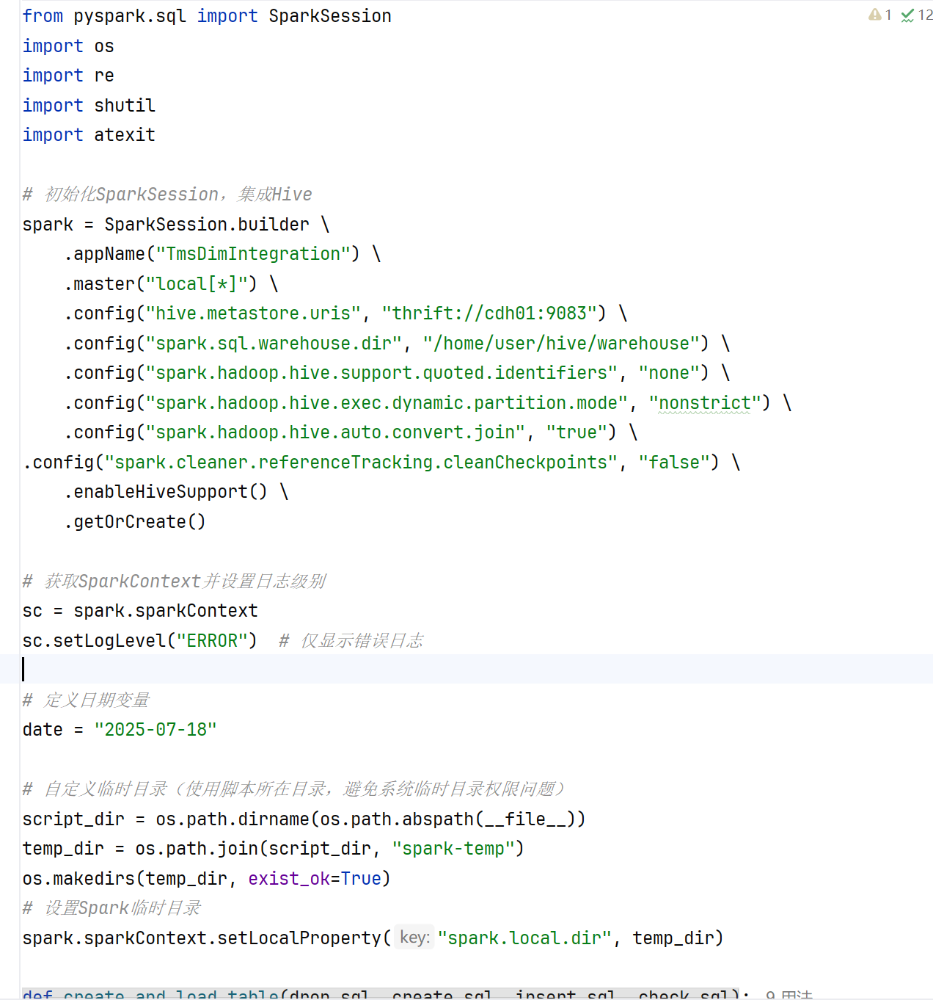
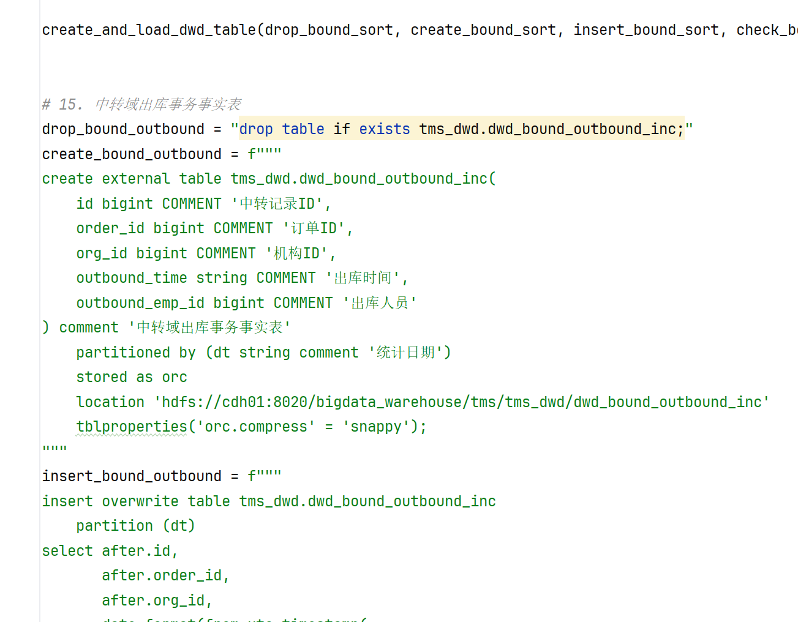
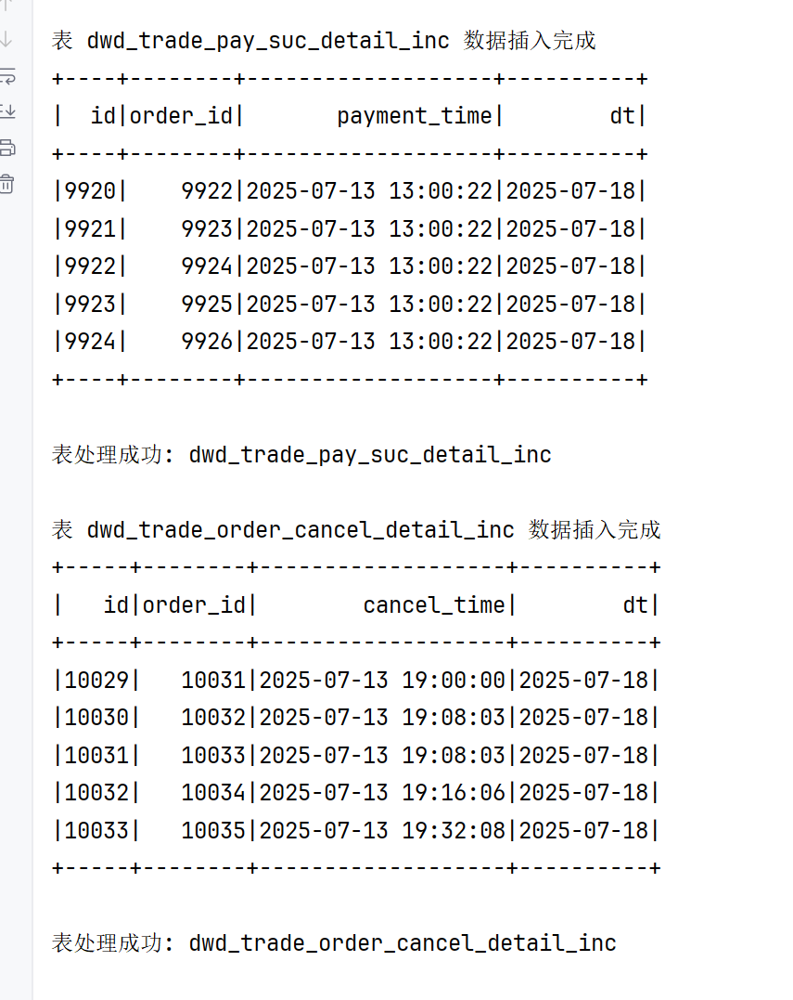
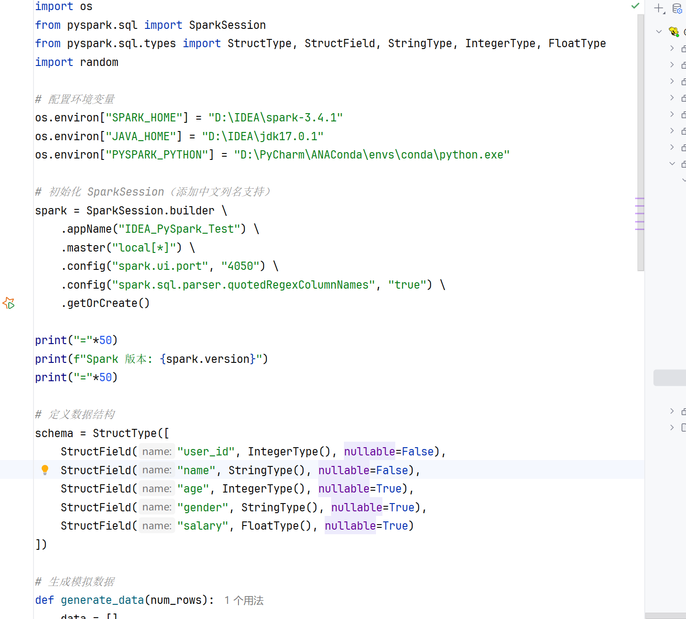
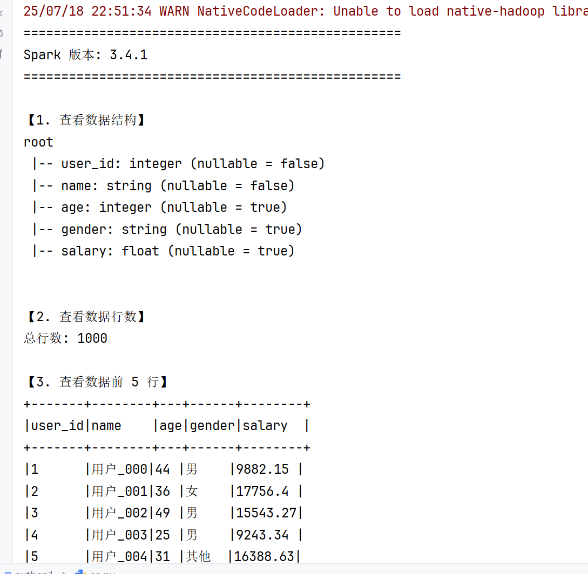

>1.把离线数仓的书写方式转换成pyspark的形式
> 
> 并且能够成功运行并输出数据
> 以上是dim层的数据的书写方式
> 2.把dwd层的数据也直接转换成pyspark的书写方式
> 
> 以上是dwd层的书写方式

> 输出效果
> 3.在idea写pyspark的时候发生了报错的情况发生
> 报错已解决，原因是因为版本不兼容导致的问题
> 
> 通过降低版本以及更换的方式促使pyspark能够成功运行

> 测试效果